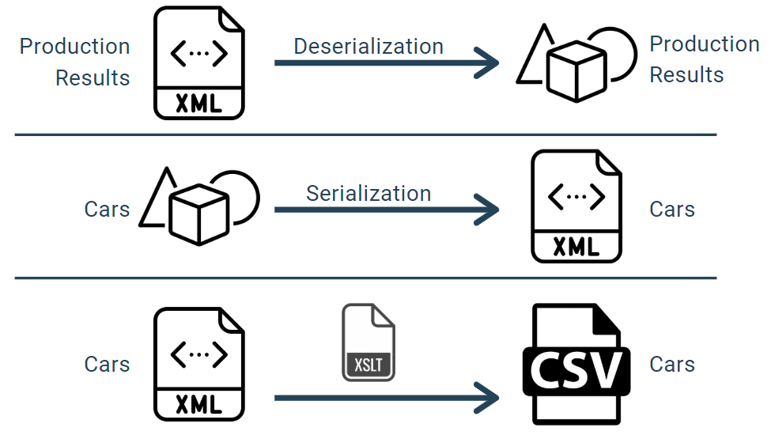
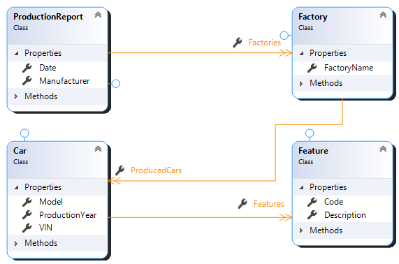
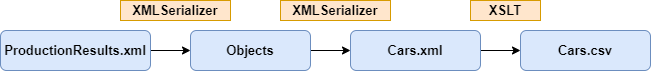

# Export of report to XML
This .NET Core 3.1 console application provides:
- deserialization of *ProductionResults.xml*,
- serialization of car objects to XML file,
- converting XML file to CSV via XSLT,
- saving XML to database using ORM,
- unit tests.


## Technologies used
- C#,
- .NET Core 3.1,
- XSLT,
- xUnit,
- EntityFramework Core,
- Microsoft SQL Server.

## Table of contents
1. Model Classes
2. Other Classes
3. Serialization
4. Conversion to CSV using XSLT
5. Conversion example
6. Tested functionalities
7. Entity Framework Core

## Model Classes


## Other classes
### Converter
Class responsible for transforming datatype. Consist of method converting XML to CSV.
### Serializer
Class responsible for XML serialization and deserialization.
### UserInteraction
Class responsible for interacting with user by displaying messages and getting user input.
### EFContext
Class responsible for connecting to database, configuring tables and relation keys.
### DatabaseSaver
Class responsible for saving data to database and error handling.
### UnitTests
Class consisting of all unit tests along with IEnumerable collections that allow running same test with multiple dataset.
### CsvDataAttribute
Class allowing to read CSV rows as arguments to unit tests.
## Serialization
Serialization and deserialization is done by *System.Xml.Serialization* library. Fields in classes are decorated with attributes identifying their position in XML file.
- Serialization is implemented as void method that takes list of cars and output file name as argument,
- Deserialization is implemented as method that takes path to file as argument and returns ProductionReport object.

## Conversion to CSV using XSLT
List of cars is converted to CSV format with header in first line. Features of each car are ommited.
## Conversion example



<details><summary>ProductionResults.xml</summary>
<p>

```xml
<ProductionReport Manufacturer="Opel" Date="2015-02-18T12:32:02.8036669+01:00">
    <Factories>
        <Factory Name="Monachium Fab">
            <ProducedCars>
                <Car VIN="O002ABC002">
                    <ProductionYear>2007</ProductionYear>
                    <Model>Vectra</Model>
                    <Features>
                        <Feature Code="RXE">Reflektory xenonowe</Feature>
                        <Feature Code="SZW">Sportowe zawieszenie</Feature>
                        <Feature Code="SZD">Szyberdach</Feature>
                    </Features>
                </Car>
                <Car VIN="O004ABC004">
                    <ProductionYear>2005</ProductionYear>
                    <Model>Astra</Model>
                    <Features>
                        <Feature Code="RXE">Reflektory xenonowe</Feature>
                    </Features>
                </Car>
            </ProducedCars>
        </Factory>
    </Factories>
</ProductionReport>
```

</p>
</details>


<details><summary>Cars.xml</summary>
<p>

```xml
<?xml version="1.0"?>
<Cars>
  <Car VIN="O002ABC002">
    <ProductionYear>2007</ProductionYear>
    <Model>Vectra</Model>
    <Features>
      <Feature Code="RXE">Reflektory xenonowe</Feature>
      <Feature Code="SZW">Sportowe zawieszenie</Feature>
      <Feature Code="SZD">Szyberdach</Feature>
    </Features>
  </Car>
  <Car VIN="O004ABC004">
    <ProductionYear>2005</ProductionYear>
    <Model>Astra</Model>
    <Features>
      <Feature Code="RXE">Reflektory xenonowe</Feature>
    </Features>
  </Car>
</Cars>
```

</p>
</details>


<details><summary>Cars.csv</summary>
<p>

```csv
VIN,Rok produkcji,Model
O002ABC002,2007,Vectra
O004ABC004,2005,Astra
```

</p>
</details>

##   Tested functionalities
- XML serialization,
- XML deserialization,
- XML to CSV conversion,
- implemented interface IEqutable,
- overridden method ToString().

## Entity Framework Core
Application is integrated with Microsoft SQL Server by Entity Framework Core 3.1. Constraints are set using Fluent API.
